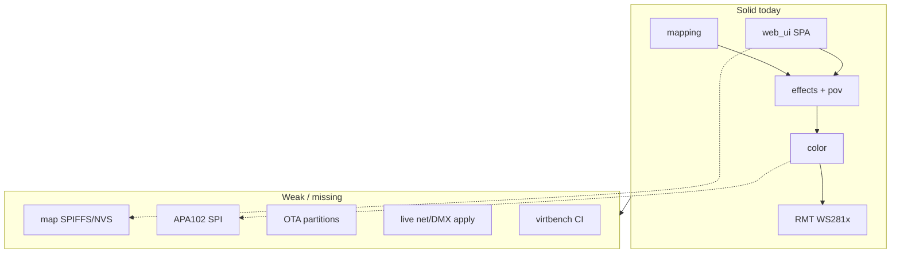

# PixelMap — Project Evaluation & Roadmap

**Status:** Living document for agents and maintainers  
**Evaluated:** 2026-07-21 (updated same day — Phase 0 + Phase 1 core landed)  
**Version at evaluation:** `0.1.0` (`VERSION`)  
**Repo:** https://github.com/NicholasTracy/pixelmap  
**Companion canvas:** open beside chat as `project-evaluation-roadmap.canvas.tsx` in the Cursor project canvases folder

> Agents: prefer this file as the source of truth for “what’s broken / missing / next.” Update it when major milestones land or new gaps are discovered.

---

## 1. Executive verdict

PixelMap is a **credible v0.1.0 spatial LED controller** for ESP32 / ESP32-S3: real multi-strip RMT output, rich spatial mapping, a large effect set, POV math, Art-Net/sACN receive, Custom Lua, and a substantial browser UI. CI builds both chip targets successfully.

It is **not yet a finished product** relative to WLED-class expectations or its own README claims. The highest-impact holes are:

1. **Pixel maps / wire-order do not survive reboot** (SPIFFS partition reserved but unused).
2. **APA102/SK9822 oversold** (SPI path is a placeholder; clock GPIO unused).
3. **Runtime config apply gaps** (Wi‑Fi / Art-Net / sACN need reboot after Save).
4. **First-boot / missing NVS namespace can abort** via `ESP_ERROR_CHECK(pm_config_load)`.
5. **No OTA, no automated tests, no release workflow.**
6. **Open HTTP UI + Wi‑Fi password returned in cleartext.**

**Positioning recommendation:** Keep marketing focused on **spatial mapping + POV + Lua** for WS281x-class strips. Treat clocked LEDs, OTA, presets, and WLED feature parity as roadmap — not current claims.

---

## 2. What works today (strengths)

| Area | Evidence |
|------|----------|
| Spatial mapping builders | `components/mapping/` — line, grid, grid3d, ring, circle, sphere, box, cylinder, dome, pyramid + JSON I/O |
| Effect engine | `components/effects/` — ~25 spatial effects + geometry params (pos/rot) + `pm_effect_render` |
| POV | `components/pov/` — rotation multi-blade + linear wand; fixed RPM/speed (documented) |
| WS281x / SK6812 / TM1814 TX | `components/led_driver/` RMT NRZ + timing tables |
| Color helpers | `components/color/` — HSV, gamma, correction, RGBW/RGBWW pack helpers |
| Config scalars in NVS | `components/config_store/` — Wi‑Fi, strip, FX, POV, layout *params* |
| Custom Lua | `components/effect_lua/` + vendored Lua 5.4; NVS script; instruction budget |
| SoftAP setup | `components/wifi_mgr/` — STA + AP fallback hotspot |
| Art-Net / sACN receive | Minimal but functional UDP paths; pixel vs param DMX modes |
| Status LED | `components/status_led/` — distinct LEDC modes |
| Web UI | Embedded SPA: Network, Strip, Effects, Lua, POV, Control, Map |
| CI | Lint + build esp32/esp32s3 + artifacts (`.github/workflows/ci.yml`) |

Render path (also in `docs/ARCHITECTURE.md`):

```
map / Art-Net / sACN / UI
        → effect engine (spatial RGB)
        → color correction / pack
        → led_driver (RMT)
        → GPIO
```

---

## 3. Defects & correctness issues (fix)

Severity: **P0** = crash/data loss/broken claim in common path · **P1** = silent wrong behavior · **P2** = polish / docs / hygiene.

### P0 — Fix before calling the product “stable”

| ID | Issue | Location | Fix direction |
|----|-------|----------|---------------|
| F1 | ~~First boot NVS abort~~ **Fixed** | `pm_config_load` treats `NOT_FOUND` as OK; `app_main` soft-fails | — |
| F2 | ~~Maps lost on reboot~~ **Fixed** | SPIFFS `/spiffs/map.json` save/load | — |
| F3 | **APA102 / SK9822 unusable** | Hidden in UI; create returns `NOT_SUPPORTED` | Implement SPI host path (Phase 3) |
| F4 | ~~Art-Net / sACN / Wi‑Fi not live~~ **Fixed** | `pm_wifi_apply` + `sync_dmx_receivers` on config change | — |

### P1 — Wrong or incomplete behavior

| ID | Issue | Location | Fix direction |
|----|-------|----------|---------------|
| F5 | Map capacity fixed at create from initial `pixel_count`; growing strips does not resize map | `main.c` map create | Destroy/recreate map (or grow) on strip rebuild |
| F6 | `s_dmx_merge` calloc unchecked | `main.c` rebuild | Check NULL; set fault mode |
| F7 | Rebuild failure ignored in render loop | `main.c` | Surface fault; avoid calling show on null buses inconsistently |
| F8 | Shared `s_cfg` / map mutated from HTTP without lock vs render task | `web_ui.c` + `main.c` | Snapshot config under mutex, or double-buffer map |
| F9 | Art-Net pixel merge is RGB×3 only into RGBW hardware | `main.c` `render_from_dmx` | Document or expand channel modes |
| F10 | RGBWW helpers exist but **no chipset sets 5 channels** | `led_chipsets.c`, README claims | Add chipset or soften README |
| F11 | Color order / clock / auto_white / universe_count in NVS but weak/missing UI+API | `web_ui.c`, Strip/Control tabs | Expose in GET/POST config + UI |
| F12 | Enabling both protocols forced exclusive in config; priority/merge absent | `artnet/`, `sacn/`, `config_store` | Document exclusivity; later HTP + sACN priority |

### P2 — Hygiene, docs, security, CI

| ID | Issue | Location | Fix direction |
|----|-------|----------|---------------|
| F13 | Wi‑Fi password in `GET /api/config`; no HTTP auth | `web_ui.c` | Omit pass on GET (or mask); optional PIN |
| F14 | SPIFFS `storage` partition unused (1 MB) | `partitions.csv` | Use for maps **or** reclaim for OTA |
| F15 | Board JSON unused; button GPIO documented but no handler | `boards/`, README | Wire import **or** demote docs |
| F16 | README map layouts understate UI (missing Box/Cylinder/Dome/Pyramid/formula) | `README.md` | Sync table to UI |
| F17 | Architecture doc wrong UI path (`www/index.html`) | `docs/ARCHITECTURE.md` | Fix path; document `/api/fx/lua` |
| F18 | Dead `fengari-web.js` (not embedded/served) | `components/web_ui/vendor/` | Remove or embed for on-device Lua preview |
| F19 | Mock server missing `fxmask` | `tools/web_ui_dev_server.py` | Match firmware JSON |
| F20 | No host/unit tests; no release workflow; `VERSION` unused in binaries | `.github/`, `VERSION` | virtbench + release.yml + embed version string |
| F21 | CodeQL `build-mode: none` weak for C | `codeql.yml` | Build-aware analysis when practical |
| F22 | `PM_STATUS_FAULT_GENERAL` unused | `status_led` | Wire or remove |
| F23 | Double white extraction in set_rgb then show | `led_strip.c` | Encode once in shared helper |

---

## 4. Feature inventory — present vs missing

### 4.1 Present (keep / polish)

- SoftAP first-run setup  
- Multi-strip (up to 8) lengths + data GPIOs  
- Spatial map editor (layouts, formula, wire order, auto-route)  
- Live effect preview in browser  
- Effect param + geometry controls + LFO modulators  
- Custom Lua (device + preview transpile)  
- POV rotation / linear  
- Art-Net + sACN (basic)  
- Status LED modes  
- CI firmware builds for esp32 + esp32s3  

### 4.2 Incomplete vs claimed

| Claim | Gap |
|-------|-----|
| APA102 / SK9822 | Placeholder only |
| RGBWW-style mixing | Helpers only; no 5-ch chipset |
| Board presets import | JSON exists; UI/firmware ignore it |
| Map persistence | Explicitly deferred in ARCHITECTURE |
| Standby / clear as control tier | Docs mention; loop has no clear standby mode |

### 4.3 Missing — should add to “complete” the project

Grouped by product pillar. **Must** = needed for a coherent 1.0. **Should** = expected by WLED/spatial users. **Could** = differentiators / later.

#### Persistence & device lifecycle (Must)

- Persist full map + wire order (+ optional groups) across reboot  
- OTA (partition table + web or USB-serial OTA)  
- Factory reset (button hold and/or UI)  
- Embed `VERSION` in firmware + `/api/config`  
- Safe first-boot defaults (F1)  

#### Hardware I/O (Must / Should)

- Real APA102/SK9822 SPI + clock pin UI (**Must** if chipset stays in UI)  
- Color order UI (**Must**)  
- Hide or finish CUSTOM chipset  
- Power/current limit estimation (board `max_ma` is unused)  
- Optional button: AP portal / reset  

#### Network & lighting control (Should)

- Hot apply Art-Net/sACN/Wi‑Fi  
- ArtPollReply / discovery; sACN priority  
- mDNS (`hostname.local`)  
- Universe count in UI  
- Optional simple HTP merge  

#### Effects & content (Should / Could)

- Presets (save effect+params+map snapshot)  
- Playlists / transitions  
- Image / bitmap upload for POV Image Plane  
- More palettes; segment-style multi-effect regions  
- Audio-reactive (Could)  
- MQTT / Home Assistant discovery (Could)  

#### UX & safety (Should)

- Auth PIN for AP/UI  
- Do not echo Wi‑Fi password  
- Live apply feedback (“reboot required” until hot-apply exists)  
- Max LED / RAM guidance in UI  
- WebSocket or SSE for live status (strip fault, IP, DMX active)  

#### Quality & release (Must for maintainable 1.0)

- Host **virtbench**: map → effect → color → packed frame goldens in CI  
- Mock server smoke in CI  
- Release workflow: tag → named merged bins on GitHub Releases  
- API contract test (firmware handlers vs mock vs UI fields)  
- Size budget gate (`idf.py size`)  

---

## 5. Architecture risks



| Risk | Why it matters |
|------|----------------|
| Flash layout | 1 MB SPIFFS unused + no OTA slots = wrong trade for a field-updatable controller |
| Per-pixel Lua @ 60 FPS | Instruction budget helps, but large strips will drop frames; needs FPS governor / dirty-region docs |
| Unlocked config/map | Rare corruption / torn reads under heavy UI save |
| Open AP + password in JSON | Home-network risk; worse on SoftAP |
| Marketing vs code | APA102/RGBWW/boards erode trust |

---

## 6. Roadmap

Phases are sequential enough to ship value; items within a phase can parallelize.

### Phase 0 — Stabilize (1–2 weeks)

**Goal:** Device always boots; docs match reality; stop overselling hardware.

- [x] F1 first-boot NVS soft-fail  
- [x] Hide APA102/SK9822 in UI **or** land SPI (prefer hide until F3 done)  
- [x] Soften README RGBWW / board-import claims  
- [x] Fix ARCHITECTURE path + API table  
- [x] Expand README mapping layouts table  
- [x] Omit Wi‑Fi password from GET (or mask)  
- [x] Mock `fxmask` parity  
- [x] Remove or wire `fengari-web.js`  

**Exit:** Fresh flash boots to SoftAP every time; README claims match UI. **Done 2026-07-21.**

### Phase 1 — Persistence & honesty (2–4 weeks)

**Goal:** What you edit in Map survives reboot.

- [x] Mount SPIFFS (or LittleFS); save/load map JSON blob  
- [x] Boot: load blob if present, else regenerate from layout params  
- [x] Persist wire-order / CUSTOM maps  
- [x] Expose color order (+ clock pin when SPI lands) in API/UI  
- [x] Hot-apply Art-Net/sACN enable/disable + Wi‑Fi restart hooks  
- [x] Map resize on strip length change (F5)  
- [x] Extract `pm_led_encode_frame` shared helper (F23 / virtbench prep)  

**Exit:** Power-cycle keeps custom map; enabling Art-Net in UI works without USB reflash. **Done 2026-07-21.**

### Phase 2 — Virtual test bench & release (2–3 weeks)

**Goal:** CI proves pixel output; releases are push-button.

- [ ] `tools/virtbench` host harness + golden frames (see prior plan)  
- [ ] CI job `virtbench` gating merge  
- [ ] Mock server smoke (config/map roundtrip)  
- [ ] `.github/workflows/release.yml` on tag: build both targets, attach merged bins, use `VERSION`  
- [ ] Expose version in `/api/config` + UI footer  

**Exit:** Broken effect/pack changes fail CI; GitHub Release matches README filenames.

### Phase 3 — Product 1.0 (4–8 weeks)

**Goal:** Installable, updatable, discoverable controller.

- [ ] Repartition for OTA (reclaim unused storage as needed) + web OTA UI  
- [ ] APA102/SK9822 real SPI path + clock GPIO  
- [ ] mDNS; ArtPollReply; sACN priority  
- [ ] Presets (effect+params; optional map link)  
- [ ] Factory reset (button + UI)  
- [ ] Optional UI PIN  
- [ ] Power estimate / brightness clamp guidance  
- [ ] Thread-safe config snapshot  

**Exit:** Tag `v1.0.0` — WS281x + optional APA102, OTA, persistent maps, CI goldens, automated release.

### Phase 4 — Differentiated 1.x (ongoing)

**Goal:** Spatial/POV product depth beyond WLED parity.

- [ ] POV image / GIF upload  
- [ ] Playlists & crossfades  
- [ ] Multi-region / segment effects on one map  
- [ ] Sensor or closed-loop RPM (opt-in)  
- [ ] MQTT / HA discovery  
- [ ] Audio reactive  
- [ ] Broader chipset pack (UTF-8 / RGBWW SK variants)  
- [ ] On-device Lua preview via embedded fengari (if kept)  

---

## 7. Suggested near-term priority order

If only a few items can be done next, do them in this order:

1. **F1** — first-boot NVS (reliability)  
2. **Map persistence** — Phase 1 core value  
3. **Hot-apply network/DMX** — stop silent UX failures  
4. **Virtbench + CI** — lock render pipeline  
5. **Release workflow + VERSION** — trustworthy installs  
6. **OTA** — field updates  
7. **APA102 SPI or remove from UI** — claim integrity  

(The previously discussed virtual LED bench belongs at step 4; it is the right CI approach — not full ESP QEMU for WS2812 bitstreams.)

---

## 8. Component maturity matrix

| Component | Maturity | Notes |
|-----------|----------|-------|
| mapping | High | Feature-rich; needs persistence consumers |
| effects | High | Solid; Lua path heavier |
| pov | High | Fixed RPM/speed by design |
| color | High | RGBWW unused by chipsets |
| led_driver | Medium | WS281x good; SPI stub |
| config_store | Medium | Scalars good; no map blob |
| effect_lua | Medium | Usable sandbox; no heap cap |
| web_ui | Medium–High | Deep UX; API field gaps |
| wifi_mgr | Basic | Works; no mDNS/hot reconfig |
| artnet / sacn | Basic | Receive-only MVP |
| status_led | High | One unused mode |
| boards | Docs-only | Not integrated |
| lua (vendor) | Vendor | Trimmed libs |

---

## 9. Brainstorm backlog (unprioritized ideas)

Use for future planning; not committed scope.

- Import WLED `cfg.json` / LED prefs subset  
- 2D matrix serpentine presets as named templates  
- Collaborative map edit (export/import QR or URL fragment)  
- Fixture library (common panels / rings with known maps)  
- DMX personality editor (channel map for PARAMS mode)  
- Recording / playback of effect timeline  
- Dual-core affinity: network vs render  
- PSRAM-aware large maps on S3  
- Watchdog + strip fault auto-clear  
- Prometheus/metrics endpoint for installs  
- Headless “effect unit” mode for CI screenshots of preview canvas  
- Bluetooth provisioning (optional, power-costly)  

---

## 10. How to update this document

When closing a roadmap item:

1. Check the box in §6 or move the ID to a “Done” subsection with date + PR/commit.  
2. Adjust §3 / §4 if reality changed.  
3. Bump the **Evaluated** date in the header.  
4. Keep the canvas in sync for high-level status if the phase shifts.

---

## 11. Quick reference — key paths

| Concern | Path |
|---------|------|
| Boot / render loop | `main/main.c` |
| NVS config | `components/config_store/` |
| LED TX | `components/led_driver/src/led_strip.c` |
| Chipset tables | `components/led_driver/src/led_chipsets.c` |
| Maps | `components/mapping/` |
| Effects | `components/effects/` |
| Lua | `components/effect_lua/` |
| HTTP + SPA | `components/web_ui/` |
| Partitions | `partitions.csv` |
| CI | `.github/workflows/ci.yml` |
| Architecture (short) | `docs/ARCHITECTURE.md` |
| This evaluation | `docs/PROJECT_EVALUATION_AND_ROADMAP.md` |
